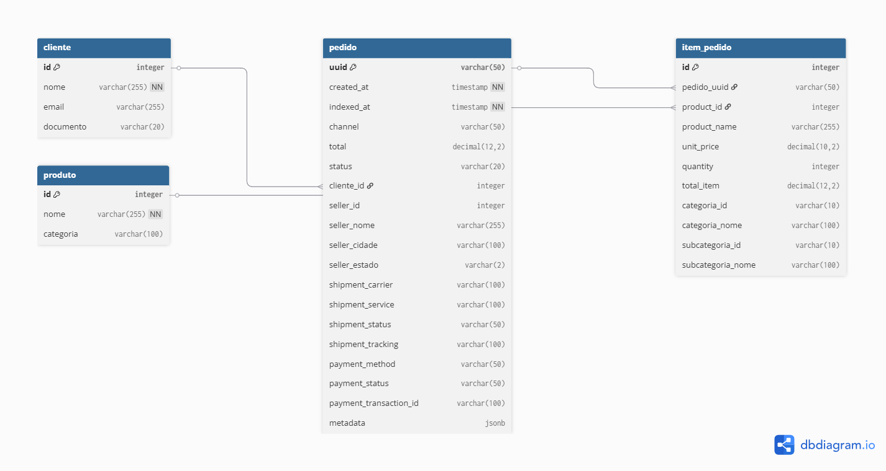

# Projeto Mensageria - Fatec

**Disciplina:** Computação em Nuvem II

## 🎯 Objetivo

Implementar um sistema de mensageria assíncrona usando **RabbitMQ** para processar pedidos de um marketplace, persistindo os dados em banco relacional PostgreSQL e expondo uma API RESTful para consulta.

## 🛠️ Tecnologias Utilizadas

- **RabbitMQ** (container) - Broker de mensagens
- **PostgreSQL** (container) - Banco relacional
- **FastAPI** (Python 3.11) - API REST
- **Docker + Docker Compose** - Containerização completa
- **SQLAlchemy** - ORM
- **pika** - Cliente RabbitMQ

## 📋 Como Executar o Projeto

```bash
docker compose up -d --build
```
# 2. Acessar os serviços

| Serviço              | URL                             |
| --------             | --------------------------------| 
| API (Swagger)        | http://192.168.1.198:8000/docs  | 
| RabbitMQ Management  | http://192.168.1.198:15672      | 
| PostgreSQL           | localhost:5432                  |

# 3. Testar

- Enviar pedido de teste: **docker exec -it api-mensageria python producer.py**
- Consultar pedidos: http://192.168.1.198:8000/orders
- Consultar pedido específico: http://192.168.1.198:8000/orders/ORD-2025-0001

# ✅ Entregáveis Cumpridos

- ## Consumidor RabbitMQ processando mensagens
- ## Persistência em banco relacional (tabelas: **pedido**, **cliente**, **produto**, **item_pedido**)
- ## Registro automático de **indexed_at**
- ## API RESTful com paginação, orgenação e filtros
- ## Payload de resposta
- ## Cálculo dinâmico de **total** do pedido e de cada item
- ## Docker Compose completo
- ## DER do banco (ver pasta docs/DER.png)

# 📊 DER do Banco de Dados



# 📁 Estrutura do Projeto

projeto-mensageria/
├── app/
│   ├── main.py
│   ├── producer.py
│   ├── Dockerfile
│   ├── requirements.txt
│   └── database/init.sql
├── docker-compose.yml
├── README.md
└── docs/
    └── DER.png